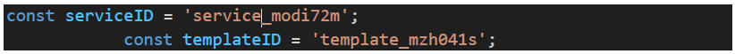
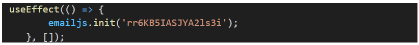
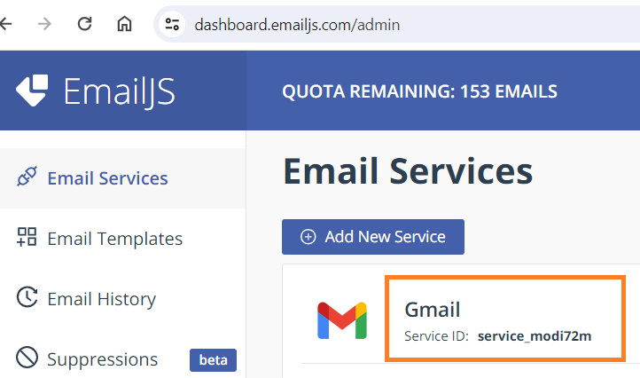
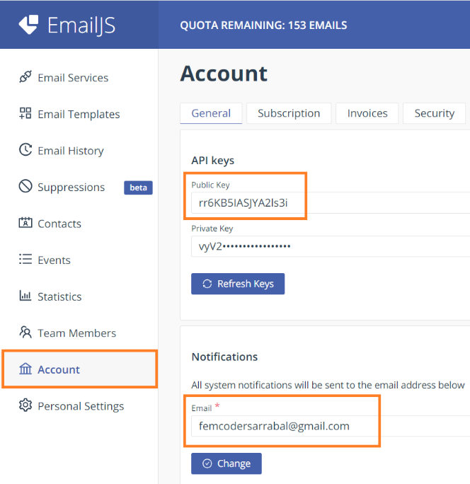
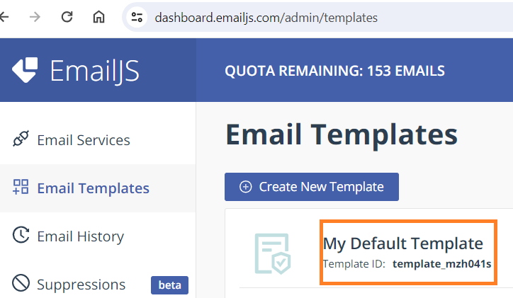

# Oviva

***
</br>

<p>

## Descripción del Proyecto

Oviva es una aplicación integral diseñada para mujeres con síndrome de ovario poliquístico (SOP). Este proyecto tiene como objetivo proporcionar una plataforma donde las usuarias puedan acceder a diversos recursos y herramientas que les ayuden a gestionar su condición y mejorar su calidad de vida. 

La aplicación ofrece una amplia gama de funcionalidades, desde la realización de un test para detectar el SOP, hasta el acceso a ejercicios de fitness específicos y recetas saludables. Además, Oviva incluye un calendario menstrual personalizado para que las usuarias puedan llevar un seguimiento detallado de su ciclo menstrual. La combinación de estos recursos permite a las mujeres realizar cambios significativos en su estilo de vida, promoviendo así una mejor salud y bienestar.
</p>

## Funcionalidades Principales

### Tipos de Usuarios

1. **Administrador (admin):**
   - Gestiona usuarios y personas registradas.
   - Inserta, modifica, elimina y consulta información de recetas, vídeos y preguntas frecuentes.

2. **Cliente:**
   - **No registrados:** 
     - Explora contenido multimedia de la página de manera limitada.
     - Envío de emails, consulta de preguntas frecuentes, visita al blog y a los expertos.
   - **Registrados:** 
     - Realiza todas las acciones disponibles para los usuarios no registrados.
     - Acceso al test de SOP, videos y recetas completas.
     - Uso del calendario menstrual.

### Características Generales
- CRUD completo de videos, recetas y preguntas y respuestas.
- CRUD completo de usuarios y personas.
- Sesiones de usuario con token y contraseña encriptada.
- Filtro por categorías cerradas: como yoga o pilates y desayunos, almuerzos, meriendas y cenas
- Estética premium y sofisticada que refleja la identidad visual de oviva.
- Navegación intuitiva y fluida.
- Registro de Usuarios: Visitantes no registrados pueden registrarse para poder comprar.

## Tecnologías Utilizadas
- **Frontend:** React.js
- **Backend:** Python (Flask)
- **Base de Datos:** MySQL
- **Administración de la Base de Datos:** PhpMyAdmin
- **CORS:** Para el manejo de solicitudes entre diferentes dominios.
- **Tokens JWT:** Para autenticación de usuarios y sesiones seguras.

<summary><h2> Configuración local del proyecto⚙ </h2></summary>

### Clonar el repositorio
 ```bash
git clone https://github.com/sandra-medina-luque/Holistic-Ovaries.git
```
<summary> <h3>Para el Frontend, debes seguir los siguientes pasos: </h3></summary>

<details> 
 
##### Entrar en la carpeta del repositorio - Frontend
```bash
cd .\Holistic-Ovaries\HolisticFront\
```
##### Par instalar las dependencias del Frontend, copia la siguiente línea
 ```bash
npm i
```
##### Para arrancar el servidor
```bash
npm run dev
```
##### Esto iniciará el servidor en __http://localhost:5173__ usando vite con React.

</details>

<summary> <h3>Para el Backend, debes seguir los siguientes pasos: </h3></summary>

<details>   
 
##### Entrar en la carpeta del repositorio - Backend
```bash
cd .\Holistic-Ovaries\HolisticBack\
```

##### Añade un entorno virtual llamado venv
```bash
python -m virtualenv venv
```

##### Activar el entorno virtual
```bash
python -m virtualenv venv
```

##### Instalar todas las dependencias a partir del archivo requirements
```bash
pip install -r requirements.txt
```

##### Arrancar el servidor - Backend
```bash
python index.py
```
</details>

<summary> <h3>Configuración de mailing </h3></summary>

<details>
<br>
1.Crea una cuenta gratuita en: https://www.emailjs.com/
   
2.En el componente FormContact.jsx: cambia serviceID y emailjs.init.





Puedes obtener estos valores en:







3. En el apartado de notificaciones cambia el email y añade tu direcciñon. 
   
</details>

<summary> <h3>Script de la base de datos </h3></summary>
<details>

## Descargar archivo SQL

Puedes descargar el archivo SQL necesario para este proyecto haciendo clic en el siguiente enlace:

[Descargar archivo SQL](https://raw.githubusercontent.com/sandra-medina-luque/Holistic-Ovaries/main/HolisticFront/public/oviva-8.sql)

Debes guardarlo con extension .sql y luego ya lo puedes importar con tu gestor de bases de datos para tener la BD del proyecto.

Si usas xampp puedes hacerlo desde PhpMyAdmin siguiendo estos pasos:

1. Accede a phpMyAdmin.
2. Selecciona la base de datos (o crea una nueva).
3. Haz clic en la pestaña "Importar".
4. Selecciona el archivo `.sql` y configura las opciones (si es necesario).
5. Haz clic en "Continuar" para iniciar la importación.
6. Verifica que la importación fue exitosa y que los datos están correctos.

</details>

## Autores
- Angy Machado https://github.com/angylearns
- Esty González https://github.com/EstyGlez
- Lorena Rodríguez https://github.com/Lorena-Rodriguez
- María Nadales https://github.com/MNblue
- Ilda Fabiana Gaona https://github.com/ilfagaro
- Helena Milla https://github.com/hacheproud
- Sandra Medina https://github.com/sandra-medina-luque

